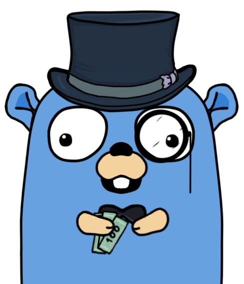

# The Money Gopher

[](https://github.com/oxisto/money-gopher/actions/workflows/build.yml)
[](https://pkg.go.dev/github.com/oxisto/money-gopher)
[](https://goreportcard.com/report/github.com/oxisto/money-gopher)
[](https://codecov.io/gh/oxisto/money-gopher)


The Money Gopher will help you to keep track of your investments.

# Why?

Surely, there are a number of programs and services out there that already
manage your portfolio(s), why creating another one? Well there are several
reasons or rather requirements that I have. Note, that these might be very
specific to my use-case, but maybe somebody else will appreciate them as well.

* 🏘️ I need to manage several portfolios for several distinct people, for
  example my own and my children's. I want to keep these portfolios completely
  separate, but still manageable within the same uniform UI or program. For a
  lack of better term, I call this a "portfolio group" for now.
* 💵 All "portfolio groups" could share stock information, such as buy/sell
  prices and meta-data. Then they only need to be retrieved once and are
  available to all "groups".
* 🤑 Within one "portfolio group", I obviously want to manage several
  portfolios, displaying certain performance values (e.g. absolute gain,
  time-weighted return, etc.) per portfolio and for the whole group.
* 📱 I want to access this information from multiple devices, e.g., my laptop,
  my tablet and my phone. But, I don't necessarily need this information on the
  go, so having some kind of "server" locally to my network and a browser-based
  UI seems to be perfect. This means that the UI tech stack should reflect
  responsiveness and a mobile-friendly design. If I *really* need this
  information on the go, I could then still set this up on a server that I own
  or VPN to my home network.
* 👨‍💻 I love APIs, so having access to this in a RPC or REST API would be
  awesome. It is anyway needed for the UI. Maybe also a simple CLI for quick
  tasks, such as triggering a refresh of stock information would also be nice.

Furthermore, there are some personal technical motivations that drove me to
creating this.

* 📞 I wanted to explore new ways of providing RPC-style APIs that are not based
  on the arguably bloated gRPC framework. Therefore, I am exploring Buf's
  [Connect](https://connectrpc.com) framework in this project, which seems
  promising, even for browser-based interactions.
* 🔲 I am still on the spiritual search for a good UI framework, so this might
  be a good chance to explore different options.
* 📈 I wanted to understand the math behind some of the used performance models,
  such as time-weighted rate of return a little bit better.

# Usage

This project has currently three main components:
* A server component [`moneyd`](./cmd/moneyd), which manages the connection to
  the database and offers a RPC-API using [Connect](https://connectrpc.com) to
  manage portfolios and securities. 
* A simple CLI [`mgo`](./cmd/mgo) which can be used to interact with
  the API.
* An even simpler [web-based user interface](./ui/), based on
  [Next.js](https://nextjs.org).


## Starting `moneyd`

After checking out the source-code, the necessary Go binaries can be compiled
using `go build ./cmd/moneyd` and can be started using `./moneyd`. It will print
out some information, but logging definitely needs to improved.

On startup, an SQLite database named `money.db` will be created (or loaded) in
the same directory as the started binary. If the database is empty, a new
portfolio named `mybank-myportfolio` and one example security will be created.

As a simple check, one can simply interact with the RPC-API with a normal HTTP
client, for example to list all portfolios.
```zsh
curl \
  --header 'Content-Type: application/json' \
  --data '{}' \
  http://localhost:8080/mgo.portfolio.v1.PortfolioService/ListPortfolios
```

This should print something like the following.

```json
{"portfolios":[{"name":"mybank-myportfolio","displayName":"My Portfolio"}]}
```

## Using `mgo`

Alternatively, a simple CLI called `mgo` can be used. It is preferable to
install it for the current user using `go install ./cmd/mgo`. Afterwards, it can
for example used to display all portfolios with `mgo portfolio list`.

### Adding Transactions

To add transactions (buy, sell, etc.) to an existing portfolio, the command `mgo
portfolio transaction create` can be used. The following shows an example for
the security with the ISIN US0378331005.
```zsh
mgo portfolio transactions create US0378331005 --portfolio-name mybank-myportfolio --amount 5 --price 120 --time="2022-01-01 10:00"
```

When successful, this should print something like the following.


The unique identifier (also called 'name') of the transaction can be used in
other calls, e.g., to modify it.

### Available Commands and Shell Completion

For a detailed list of all available commands see `mgo --help`. The CLI also
supports (basic) shell completion. For details how to activate it, please see
`mgo completion`.


## Using the UI

Navigate to the `ui` folder and then either start a development server using
`npm run dev` or build a production server like the following:
```bash
npm run build
npm run start
```

In either case, the UI is available on http://localhost:3000 and currently
configured to expect the API server at http://localhost:8080. In the future,
this will be made configurable for real server deployments.

# When is it finished?

Since I am working on this in my spare time, it will probably take a while 😃.
